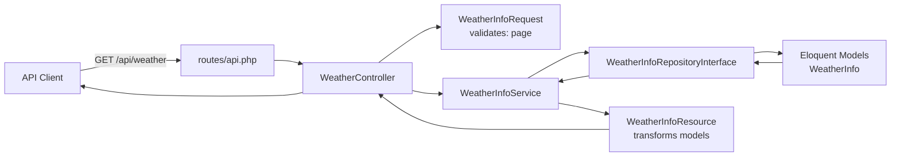
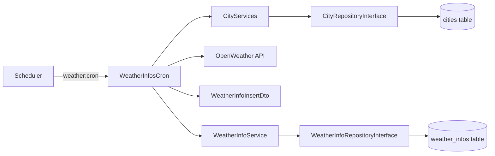

# Weather API (Laravel)

Laravel 11 API that periodically fetches current weather data from the OpenWeather API (by city latitude/longitude), stores it in a database, and exposes REST endpoints to query stored records.

## Requirements

- PHP **8.2+**
- Composer
- A database (e.g. MySQL / MariaDB / PostgreSQL / SQLite)
- OpenWeather API key

## Installation

1) Create your environment file:

```bash
cp .env.example .env
```

2) Configure the database connection in `.env` (example for MySQL):

```dotenv
DB_CONNECTION=mysql
DB_HOST=127.0.0.1
DB_PORT=3306
DB_DATABASE=weatherapi
DB_USERNAME=root
DB_PASSWORD=
```

Also set your OpenWeather API key:

```dotenv
WEATHER_API_KEY=your_openweather_api_key_here
```

3) Generate application key:

```bash
php artisan key:generate
```

4) Install PHP dependencies:

```bash
composer install
```

5) Initialize the database (migrations + seeders):

```bash
php artisan migrate --seed
```

6) (Optional) Run the app locally:

```bash
php artisan serve
```

### Production note

When deploying to production, update the following in `.env`:

```dotenv
APP_ENV=production
APP_DEBUG=false
```

## Weather cron job

The project includes an Artisan command that fetches the current weather for all cities in the `cities` table and stores the results.

- **Manual run**:

```bash
php artisan weather:cron
```

- **Local development (scheduler “daemon”; runs scheduled tasks continuously)**:

```bash
php artisan schedule:work
```

Scheduling is defined in `routes/console.php` and is configured to run every 10 minutes with `withoutOverlapping()`.

## API endpoints

Base URL (local): `http://127.0.0.1:8000`

### 1) List stored weather infos (paginated)

`GET /api/weather?page=1`

Notes:
- `page` is optional and must be an integer ≥ 1.
- The backend returns **20 records per page**.

Example:

```bash
curl "http://127.0.0.1:8000/api/weather?page=1"
```

### 2) Get the last 24 hours by city name

`GET /api/weather/{city}`

Notes:
- `{city}` is matched against the stored `name` field (case-insensitive).
- URL-encode city names that contain spaces or special characters.

Example:

```bash
curl "http://127.0.0.1:8000/api/weather/Budapest"
```

## Architecture & design patterns

This project uses a layered approach around common Laravel patterns:

- **Controller**: HTTP entry point, returns JSON responses (`app/Http/Controllers`).
- **FormRequest**: input validation and normalization (`app/Http/Requests`).
- **Service**: business logic / orchestration (`app/Services`).
- **Repository**: data access layer (Eloquent queries) behind interfaces (`app/Repositories`).
- **DTO**: data transport objects for internal boundaries (`app/DTO`).
- **Resource**: shapes Eloquent models into API response payloads (`app/Http/Resources`).
- **Provider**: service container bindings (interfaces → implementations) (`app/Providers`).

### Request flow diagram (HTTP)



### Request flow diagram (cron)



## Project structure

```text
app/
├── Console/
│   └── Commands/
│       └── WeatherInfosCron.php          # `php artisan weather:cron`
├── DTO/                                  # Data Transfer Objects
│   ├── ServiceResponse.php
│   └── WeatherInfoInsertDTO.php
├── Http/
│   ├── Controllers/                      # API Controllers
│   │   └── WeatherController.php
│   ├── Requests/                         # Form Request validation
│   │   └── WeatherInfoRequest.php
│   └── Resources/                        # API Resources (response shaping)
│       ├── CityResource.php
│       └── WeatherInfoResource.php
├── Models/                               # Eloquent models
│   ├── City.php
│   └── WeatherInfo.php
├── Providers/                            # Service providers / container bindings
│   ├── AppServiceProvider.php
│   └── RepositoryServiceProvider.php
├── Repositories/                         # Repository pattern
│   ├── CityRepository.php
│   ├── CityRepositoryInterface.php
│   ├── WeatherInfoRepository.php
│   └── WeatherInfoRepositoryInterface.php
└── Services/                             # Business logic
    ├── CityServices.php
    └── WeatherInfoService.php
```

## Providers

Providers are the place where Laravel is configured and where application services are registered in the **service container**.

- **`App\Providers\RepositoryServiceProvider`** binds repository interfaces to concrete implementations (e.g. `WeatherInfoRepositoryInterface` → `WeatherInfoRepository`). This enables clean dependency injection in services/controllers.
- Providers are registered in **`bootstrap/providers.php`** (Laravel 11 style).
